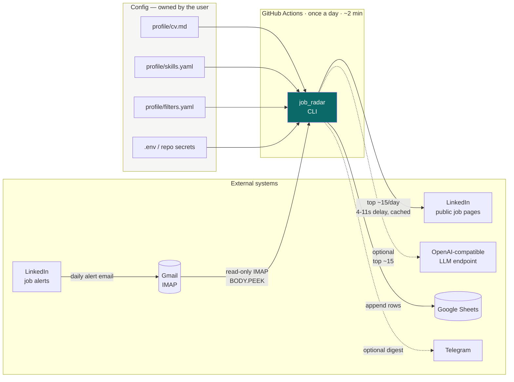
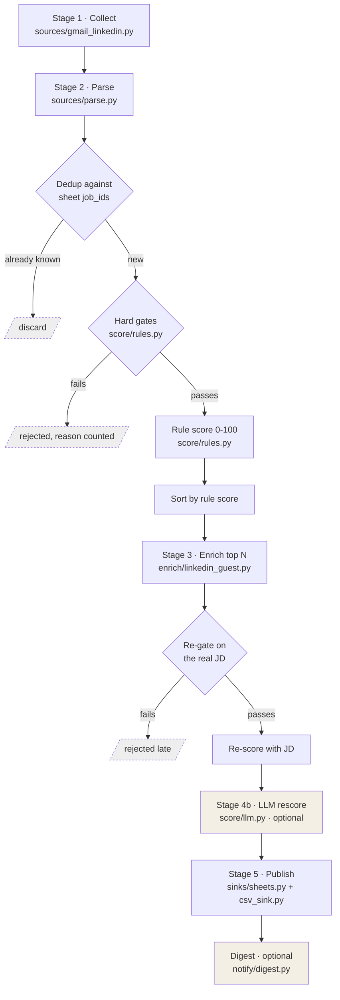
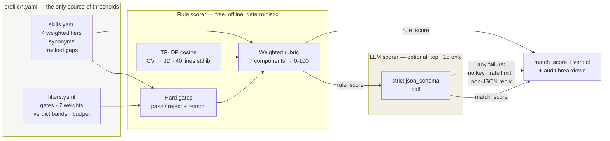
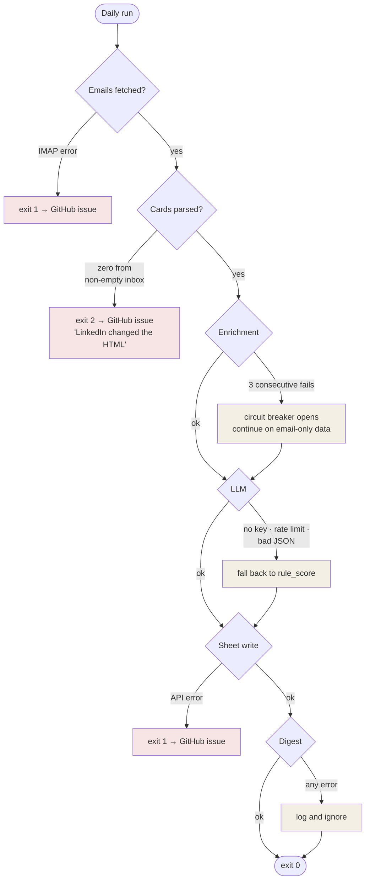
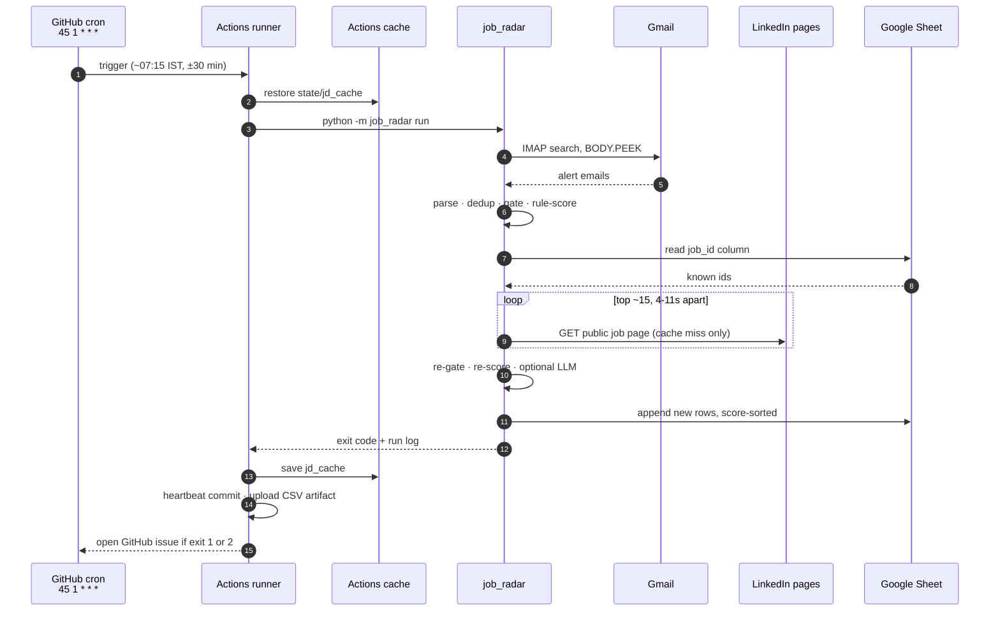

# Job Radar — System Design

The shape of the system, the contracts between its parts, and the reasoning
behind each boundary. For *why* the pipeline exists at all, see
[DESIGN.md](DESIGN.md); for how to run it, see [README.md](../README.md).

---

## 1 · One-paragraph summary

Job Radar is a **batch ETL pipeline with a scoring stage**, run once a day by a
scheduler, with no server, no database and no user interface. It reads a
permission-granted feed (LinkedIn's own alert emails) out of Gmail over IMAP,
normalizes each job into a single record type, rejects what fails hard policy,
enriches a small ranked shortlist with the full job description, scores what's
left against a CV and a weighted rubric, and appends the result to a Google
Sheet that doubles as both the user interface and the deduplication index.

Every design decision below follows from three constraints: **it must run
unattended**, **it must cost nothing**, and **it must not depend on anything
LinkedIn can revoke.**

---

## 2 · Context diagram

Who talks to what, and in which direction.



Solid arrows are required paths; dotted arrows are optional and degrade to a
no-op on failure.

**Trust boundaries.** Three credentials cross a boundary: the Gmail App Password
(read-only scope by convention — the code only ever issues `BODY.PEEK`), the
Google service-account key (write scope, but to a single sheet the user shares
with it), and the LLM key (outbound only). None of them is a LinkedIn
credential, which is the point: **nothing the pipeline holds can get a LinkedIn
account restricted.**

---

## 3 · The pipeline

Five stages. Each takes a list of `Job` records and returns a list of `Job`
records, so any stage can be replaced or removed without touching its
neighbours.



### Stage table

| # | Stage | Module | Input → Output | Failure behaviour |
|---|---|---|---|---|
| 1 | Collect | `sources/gmail_linkedin.py` | IMAP mailbox → raw emails | Hard fail — no input, no run |
| 2 | Parse | `sources/parse.py` | email HTML → `RawCard[]` | Never raises; zero yield → exit code `2` |
| — | Dedup | `sinks/sheets.py` | `Job[]` → unseen `Job[]` | Hard fail — writing without dedup duplicates rows |
| 3a | Gate | `score/rules.py` | `Job[]` → surviving `Job[]` | Pure function, cannot fail |
| 3b | Enrich | `enrich/linkedin_guest.py` | top-N `Job[]` → `Job[]` + JD text | Degrades — circuit breaker, keeps email-only metadata |
| 4 | Rule score | `score/rules.py` | `Job[]` → scored `Job[]` | Pure function, cannot fail |
| 4b | LLM score | `score/llm.py` | top-N `Job[]` → rescored `Job[]` | Degrades — falls back to the rule score |
| 5 | Publish | `sinks/sheets.py`, `sinks/csv_sink.py` | `Job[]` → appended rows | Hard fail — the run's whole purpose |
| — | Digest | `notify/digest.py` | published `Job[]` → message | Degrades — silent no-op |

Three stages are allowed to fail the run; four are not. That split is the single
most load-bearing design rule in the codebase, and it is stated in
[CLAUDE.md](../CLAUDE.md) as a convention: **every optional stage degrades.**

---

## 4 · Ordering: why dedup comes third

The stage order is chosen for **cost**, not for readability.

```
collect → parse → DEDUP → gate → rule-score → enrich → re-gate → re-score → LLM → publish
                   ↑                            ↑                            ↑
             free filter                   costs a network request      costs tokens
```

Both expensive operations sit behind two free filters:

1. **Dedup before everything.** A job already in the sheet never costs a fetch or
   a token, however many times LinkedIn re-sends it in an alert email.
2. **Gate before enrich.** A job that fails a hard filter is rejected on
   email-only metadata, so an internship or a Senior role never reaches the
   network stage.
3. **Rule-score before enrich.** The enrichment shortlist is chosen by rule score
   rather than arrival order, so the ~15 fetches a day are spent on the 15 jobs
   most likely to deserve them — and anything below `skip_if_rule_score_below`
   is skipped entirely.
4. **Re-gate after enrich.** The full JD can reveal what the title hid ("5+ years
   required"). Late rejection is cheaper than a wrong row in the sheet.

The result: a run that sees 200 job cards typically makes fewer than 15 outbound
requests, and often zero LLM calls beyond the top slice.

---

## 5 · The data model

Every stage speaks one record type: `Job` in `models.py`. Stages add fields;
none of them reshape it.

```
RawCard  — everything the alert email carries
   job_id · role_title · company · location · apply_url · posted_hint
      |
      |  Job.from_card()
      v
Job  — the record every stage speaks
   identity     job_id  <-- dedup key, cache key, CSV primary key
                first_seen
   from email   role_title · company · location · posted_at
                applicants · salary · work_mode · seniority · vacancy_type
   + stage 3    enriched · jd_text
   + stage 4    rule_score · score_breakdown · matched_skills
                missing_skills · why_matched · jd_summary
   + stage 4b   match_score          <-- the LLM writes here and nowhere else
   never written  status · notes       <-- seeded blank once, then untouched
```

Two properties of this model matter more than its fields:

- **`job_id` is the identity, everywhere.** It's the dedup key in the sheet, the
  cache key for the JD, and the primary key of the CSV mirror. One id, three
  systems, no mapping table.
- **`rule_score` and `match_score` are separate fields.** The LLM writes to
  `match_score` only; `rule_score` survives untouched. That is what makes the AI
  layer removable — turn it off and `match_score` falls back to the rule score,
  with no other code path changing.

---

## 6 · Scoring architecture

Scoring is two independent scorers with a fallback relationship, not a chain.



### The rubric

Seven components, weights summing to 100, all read from `filters.yaml`:

| Weight | Component | Measures |
|---:|---|---|
| 33 | `must_have_skills` | Tier-weighted overlap — a `core` hit counts 4× a `learnable` one |
| 15 | `seniority_fit` | Years required vs. ceiling, plus inferred band |
| 13 | `adjacent_skills` | Familiar/learnable hits + TF-IDF similarity of CV to JD |
| 13 | `freshness` | Posting age × applicant count |
| 12 | `ai_domain_bonus` | Target-role title match + AI signals in the JD |
| 9 | `location_mode` | Position in the work-mode preference order |
| 5 | `compensation` | Advertised comp against the reference figure |

Three architectural properties of the scorer, each deliberate:

- **Gate and rubric are separate.** Gates answer *would I ever take this*, the
  rubric answers *how good is it*. Collapsing them into one weighted number
  would let a spectacular match sneak past a hard "no" — a Senior role with a
  perfect stack would score 88 and waste a morning.
- **Evidence quality is capped.** A job scored from the email alone has its skill
  component scaled to 70%: title-only evidence must not manufacture a top score.
- **The breakdown is persisted.** All seven component scores live in
  `score_breakdown`, and one sentence of it reaches the sheet as `why_matched`.
  A score you cannot audit is a score you stop trusting by week three.

---

## 7 · State and storage

The system has **no database**. Four persistence surfaces, each with exactly one
job:

| Surface | Holds | Lifetime | Why not a DB |
|---|---|---|---|
| **Google Sheet** | Every published row + the dedup index | Forever | It's the UI *and* the index. Delete a row and it comes back tomorrow — self-healing |
| **`state/jd_cache/`** | One fetched JD per `job_id` | Forever, restored across CI runs | Makes each posting cost LinkedIn exactly one request, ever |
| **`state/last_run.txt`** | One-line run summary | Overwritten each run | The heartbeat commit that stops GitHub disabling the cron |
| **CSV mirror** | Same rows as the sheet | Forever | Local copy, same dedup key — the sheet's offline twin |

Using the sink as the index is the trick that removes an entire component. There
is no state file to commit, no migration to run, and no way for the index to
drift out of sync with the data — because they're the same rows.

---

## 8 · Failure model

The two failure questions for anything unattended: *what breaks the run*, and
*how do I find out.*



**Exit codes are the alerting layer.** `0` fine, `1` crashed, `2` zero yield from
a non-empty inbox. The workflow opens a deduplicated GitHub issue on `1` and `2`
— so a week of failures is one issue, not seven, and the notification arrives
through a channel already on the user's phone.

Zero-yield deserves its own code because it is the **silent** failure: the run
succeeds, the sheet simply stops growing, and you conclude that hiring slowed
down. Naming it as a distinct outcome is what turns a two-week mystery into a
morning notification.

### Operational hazards designed around

| Hazard | Mitigation |
|---|---|
| Google OAuth refresh tokens expire in 7 days (Testing consent screen) | IMAP + App Password; service account for Sheets — neither expires |
| GitHub runners are datacenter IPs; LinkedIn rate-limits them | ≤15 fetches/day, randomized 4–11s delays, permanent cache, circuit breaker |
| GitHub disables cron after 60 days of repo inactivity | Heartbeat commit on every scheduled run |
| GitHub cron is approximate and skips peak times | Odd-minute schedule (`45 1 * * *`) + fully idempotent runs, so a missed day self-heals |
| LinkedIn changes the alert HTML | `.eml` fixtures, fallback selectors, plain-text fallback, exit `2`, auto-issue |

---

## 9 · Deployment view



**Runtime footprint:** ~2 minutes of a shared runner per day. Well inside the
2,000 free private minutes per month, and unmetered on a public repo.

**Portability:** the CLI has no GitHub-specific code. Anything that can run
`python -m job_radar run` with the right environment — cron on a VPS, a Pi,
Task Scheduler — works identically. GitHub Actions is a deployment choice, not a
dependency.

---

## 10 · Extension points

The seams that were designed to be cut.

| To add | Touch | Why it's cheap |
|---|---|---|
| **A new job source** (Naukri, Adzuna, Greenhouse/Lever/Ashby) | One new module in `sources/`, producing `RawCard` | Stage 1 is an interface. Everything downstream speaks `Job` |
| **A new sink** (Notion, Airtable, Postgres) | One module in `sinks/` exposing `existing_job_ids` + `append_jobs` | The sink contract is two functions |
| **A different LLM** | `LLM_BASE_URL` env var | Any OpenAI-compatible endpoint — Groq, Together, a local model |
| **Different policy** | `profile/*.yaml` only | No thresholds, titles or weights exist in Python |
| **A new scoring component** | `score/rules.py` + a weight in `filters.yaml` | Weights are read, validated against 100, and reported per-component |

The one place *not* to extend casually is `sources/parse.py`. It is the only
module an external party can break unilaterally, and the convention is strict:
change it only against a real `.eml` fixture, and add the assertion in the same
commit.

---

## 11 · What this design deliberately does not have

Each omission is a decision, not a gap.

- **No scraper and no browser automation.** The input is a feed the user is
  entitled to. Nothing here can get a LinkedIn account restricted.
- **No database.** The sink is the index. One less service, one less migration,
  one less way for state to drift.
- **No web frontend.** A spreadsheet already does filtering, sorting, sharing,
  mobile access and offline export better than a bespoke UI would, and the user
  already knows how to use it.
- **No queue or worker pool.** Daily batch, ~200 records, two minutes. Concurrency
  here would only make the rate-limit problem worse.
- **No heavy ML stack.** No numpy, no scikit-learn. The TF-IDF cosine similarity
  is 40 lines of standard library; the whole install is seven packages, which is
  what makes a cold CI run take seconds.
- **No write access to the user's columns.** `status` and `notes` are seeded once,
  blank, and never touched again. The pipeline owns the data it produces; the
  user owns their judgement about it.

---

## 12 · Quality gates

```bash
pytest -q            # 57 tests, fully offline — no network, no credentials, no spend
pyflakes src tests   # must be silent
```

The suite is offline by construction: the LLM layer is tested against a fake
client that also simulates a `json_schema` rejection, and the end-to-end tests
are pinned to a fixture profile so that tuning a personal `skills.yaml` can never
break them. **A test suite that needs credentials is a test suite that stops
being run** — which, for the one module an external party can break, would be
fatal.
